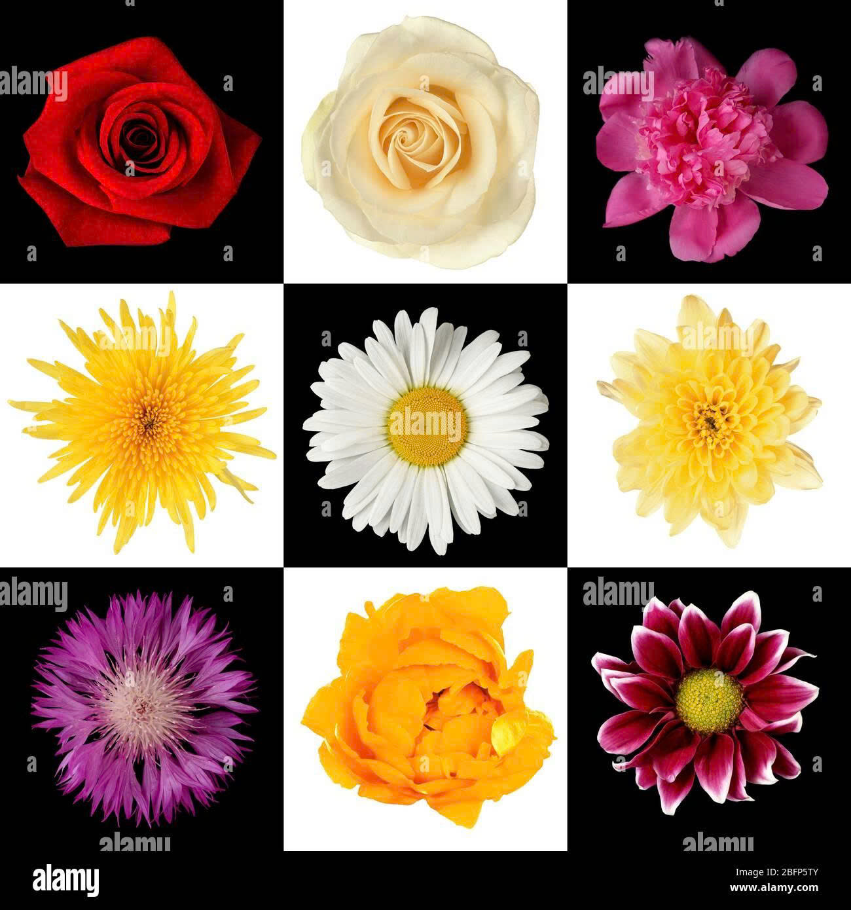
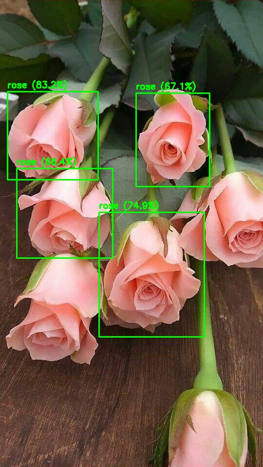
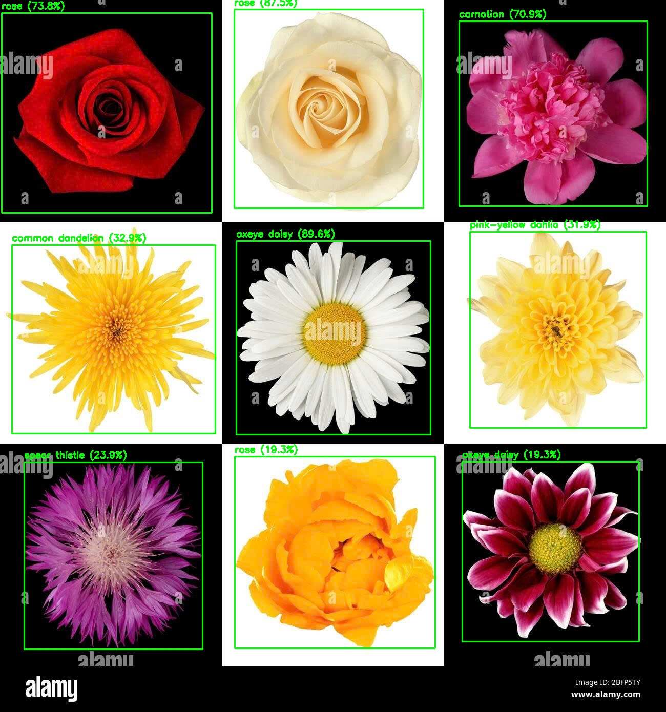
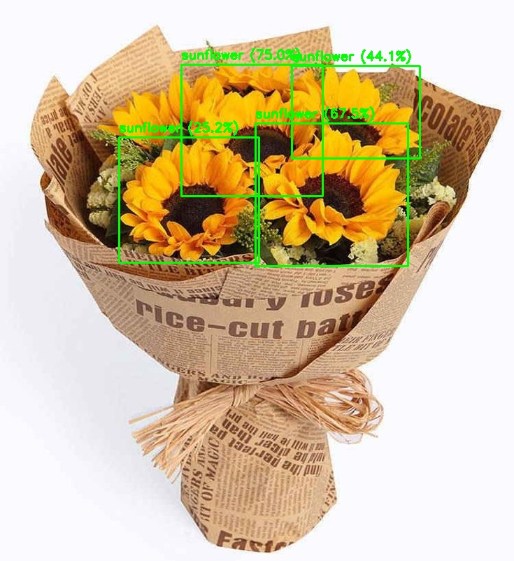
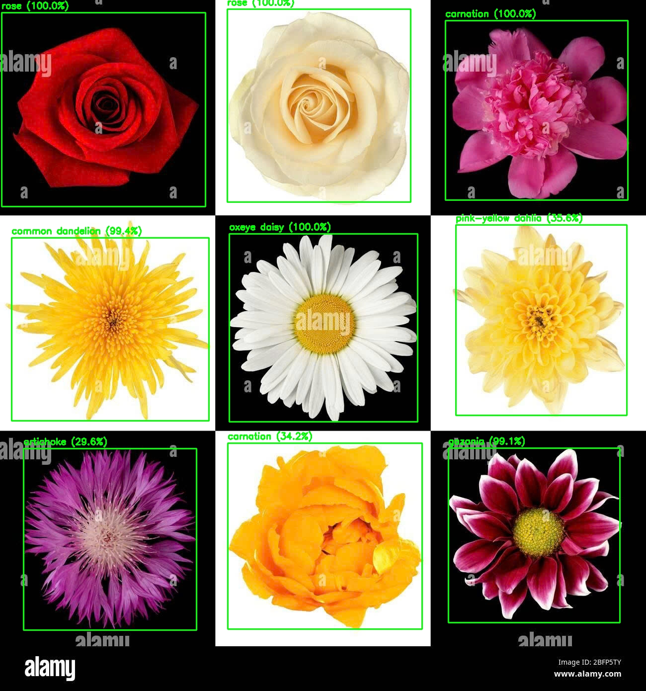

# Flower Detection and Recognition using YOLO, ConvNeXt and Vision Transformer (ViT)

## Overview
This project presents an end-to-end flower recognition system combining **object detection** and **image classification**.

- **YOLO** is used to detect flowers in images and localize bounding boxes.
- **ConvNeXt** and **Vision Transformer (ViT)** are used to classify detected flowers into specific categories.

The project demonstrates a complete computer vision pipeline from raw images to final flower species prediction, suitable for real-world applications such as smart gardening and plant identification systems.

---

## Dataset
- **Oxford 102 Flower Dataset**
- 102 flower categories
- Images with high variation in background, scale, and lighting conditions

The dataset is used for:
- Training and evaluating classification models (ConvNeXt, ViT)
- Detection data is prepared by converting images into YOLO format

---

## Models
### 1. Object Detection
- **YOLO**
  - Detects flower regions and outputs bounding boxes

### 2. Image Classification
- **ConvNeXt**
  - CNN-based architecture with strong feature extraction capability
- **Vision Transformer (ViT)**
  - Transformer-based model that captures global image context

---

## System Pipeline
1. Input image
2. Flower detection using YOLO
3. Crop detected flower regions
4. Flower classification using ConvNeXt or ViT
5. Final prediction output

---

##  Experimental Results
| Task            | Model      | Metric        | Result  |
|-----------------|------------|---------------|---------|
| Detection       | YOLO       | mAP           | 0.771   |
| Classification  | ConvNeXt   | Accuracy      | 0.9951  |
| Classification  | ViT        | Accuracy      | 0.9902  |

> Results may vary depending on training configuration.

---

## Demo Results

### Input Image
| | | |
|---|---|---|
|  |  |  |

### ConvNeXt
| | | |
|---|---|---|
|  |  |  |

### ViT
| | | |
|---|---|---|
|  |  |  |

---
## Log
ConvNeXt

[https://wandb.ai/tuankiet1302051-fpt-university/CNN-Flower-Classification/reports/ConvNext--VmlldzoxNTc5MTkxNg?accessToken=c6ab9qyj6l3dtgxaqs0nczbehk6tt0sp01lz1j6y76f4yyy10eybzeepuikrsuni
](https://api.wandb.ai/links/tuankiet1302051-fpt-university/cm30jqd5)

